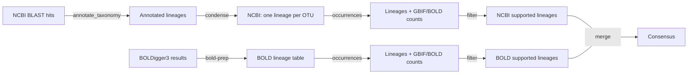

# taxcord


Consensus taxonomic assignment from BLAST hits, refined with GBIF/BOLD
occurrence records for DNA metabarcoding.

`taxcord` turns raw BLAST hits into a single, defensible taxonomic lineage per
query sequence (OTU/ASV), then refines those lineages against regional
occurrence records from [GBIF](https://www.gbif.org/) and
[BOLD](https://www.boldsystems.org/). It targets diet metabarcoding studies and
applies to any BLAST-based taxonomic assignment.

## Pipeline

Taxonomy is derived two independent ways — from NCBI (BLAST) and from BOLD
([BOLDigger3](https://github.com/DominikBuchner/BOLDigger3)). The two branches
stay **completely separate**, each running its own `occurrences` → `filter`
refinement, and only come together at the very end: a single `merge` command
takes both filtered tables and reconciles them. BOLDigger3 already returns one
identification per OTU, so `bold-prep` only reshapes its result table into the
input `occurrences` expects.



You run `occurrences` and `filter` **twice** — once per branch, on separate
files — then a single `merge` reconciles the two.

| Step | Command | What it does |
|------|---------|--------------|
| Annotate (NCBI) | `Rscript scripts/annotate_taxonomy.R` | Adds a full lineage to each BLAST hit using NCBI taxonomy. |
| Condense (NCBI) | `taxcord condense` | Collapses many BLAST hits per OTU into one lineage by rank-wise consensus. |
| Prep (BOLD) | `taxcord bold-prep` | Reshapes a BOLDigger3 result table into the lineage table `occurrences` reads. |
| Occurrences | `taxcord occurrences` | Annotates lineages with GBIF/BOLD record counts for a region. |
| Filter | `taxcord filter` | Trims each lineage to the finest rank with occurrence support. |
| Merge | `taxcord merge` | Combines the NCBI and BOLD branches into one consensus lineage. |

`condense` and `bold-prep` are the two branches' entry points — `condense`
collapses NCBI's many BLAST hits per OTU, while BOLDigger already returns one
identification per OTU, so `bold-prep` only reshapes it. After either, run
`occurrences` and `filter` on each branch, then `merge` the two.

## Install

taxcord requires Python ≥ 3.10. Create and activate a dedicated conda
environment (recommended):

```bash
conda create -n taxcord python=3.11
conda activate taxcord
```

Then install taxcord into it:

```bash
pip install -e .            # runtime use
pip install -e ".[dev]"     # plus pytest, black, ruff
```

Installing with `-e` (editable) means code changes take effect immediately
without reinstalling. After install, the `taxcord` command is on your PATH.

The annotation step is an R script and relies on the third-party
[`taxonomizr`](https://cran.r-project.org/package=taxonomizr) package (by Scott
Sherrill-Mix — not part of `taxcord`) to map NCBI taxids to lineages. You don't
need to install it by hand: `annotate_taxonomy.R` installs it automatically if
it's missing. To learn how it works or how to cite it, see its
[CRAN page](https://cran.r-project.org/package=taxonomizr) or run
`citation("taxonomizr")` in R.

## Command-line basics

`taxcord` is a single command with one sub-command per pipeline step. Every
sub-command takes its input and output file paths as positional arguments, so
the general shape is:

```bash
taxcord <step> <input> <output> [options]
```

List the steps, or see the options for any one of them, with `-h`:

```bash
taxcord -h                  # list all sub-commands
taxcord occurrences -h      # options for one sub-command
```

The steps are meant to be run in order, each consuming the previous step's
output (see the [pipeline](#pipeline) above).

## Try it on the example data

No data of your own handy? The [`examples/`](examples/) folder ships a small
**synthetic** dataset (public taxa, made-up OTU IDs) that runs the whole
pipeline — see [`examples/README.md`](examples/README.md) for the files, the
commands to run them, and what each OTU demonstrates.

## Usage

### 1. (NCBI branch) Annotate BLAST hits with taxonomy (R)

```bash
Rscript scripts/annotate_taxonomy.R <blast_input> <taxonomy_output> [accessionTaxa.sql] [--force]
```

```bash
Rscript scripts/annotate_taxonomy.R data/blast/sample.blast data/taxonomy/sample_annotated.txt
```

The input is a tab-delimited BLAST table containing an `staxids` column; the
script (via `taxonomizr`) turns each taxid into a full lineage and writes a
pipe-delimited table.

To do that it needs a local NCBI taxonomy database (`accessionTaxa.sql`, several
GB). The script finds or fetches it for you:

- **Have one already?** Pass its path as the third argument — it can live in any
  folder, separate from the script or your BLAST input.
- **Don't pass a path?** It looks for `accessionTaxa.sql` in a `data/` folder
  next to the script, and downloads it there on first run if it's absent.
- An existing database is **never re-downloaded or overwritten** unless you add
  `--force`.

The download is several GB, so the first run takes a while; later runs reuse the
same file.

### 2. (NCBI branch) Condense hits into one lineage per query

```bash
taxcord condense data/taxonomy/sample_annotated.txt data/taxonomy/sample_condensed.txt
```

For each query the best hit's percent identity selects how finely to resolve
(≥99 % → species, ≥97 % → genus, ≥90 % → family, ≥85 % → order, otherwise
class). The hits above the identity floor then vote: a rank is assigned when one
value covers at least 80 % of the hits that have a value there, walking up the
hierarchy until a rank agrees.

Options:

- `--qcovs-min FLOAT` — minimum query coverage for a hit to count (default
  `91`).
- `--tier RANK:TRIGGER[:FLOOR]` — override the identity bands used above.
  Repeatable. See below.

#### Understanding `--tier`

Each tier answers two questions using a hit's **percent identity** (how closely
the query matched the reference):

- **`TRIGGER`** — *how good the **best** hit must be to attempt this rank.* If
  the best hit's identity is **≥ TRIGGER**, the query is resolved down to
  `RANK`. `TRIGGER` is a lower bound (a `≥`), so "resolve to species when the
  best hit is ≥99 %" is `species:99` — **not** `species:100`.
- **`FLOOR`** *(optional)* — *which hits get to **vote** on the call:* every hit
  with identity **≥ FLOOR** joins the vote (a rank is assigned when one value
  covers ≥80 % of the voting hits). If you omit `FLOOR`, it defaults to
  `TRIGGER`.

So the default `species:99:97` means: *"if the best hit is ≥99 %, make a species
call, and let every hit ≥97 % vote on which species."* `FLOOR` is set below
`TRIGGER` here so a single top hit doesn't decide the species alone.

You only give each tier a **lower** threshold (`TRIGGER`), never an upper one.
taxcord checks the tiers in order, starting with the highest `TRIGGER`, and
stops at the **first** tier the best hit reaches (`best hit ≥ TRIGGER`). Because
it stops there, each tier automatically covers everything from its own
`TRIGGER` up to just below the next-higher one — so the thresholds carve the
0–100 % identity scale into bands on their own. With the defaults:

| best-hit identity | tier cleared first | resolves to |
|-------------------|--------------------|-------------|
| 99 – 100 %        | `species:99:97`    | species     |
| 97 – 98.9 %       | `genus:97:97`      | genus       |
| 90 – 96.9 %       | `family:90:90`     | family      |
| 85 – 89.9 %       | `order:85:85`      | order       |
| below 85 %        | `class:0:0`        | class       |

Those five are the **defaults**. `--tier` overrides only the ranks you name and
leaves the rest untouched. For example, to demand ≥98 % for a species call (with
voting at ≥97 %) and ≥96 % for genus:

```bash
taxcord condense in.txt out.txt --tier species:98:97 --tier genus:96
```

Here `genus:96` omits the floor, so its floor is also `96`. To reproduce the
built-in defaults explicitly you would pass all five:
`--tier species:99:97 --tier genus:97:97 --tier family:90:90 --tier order:85:85 --tier class:0:0`.

### BOLD branch — prepare a BOLDigger3 result table

This is the BOLD branch's own entry point: the counterpart to steps 1–2, run
**instead of** Annotate + Condense (not after them). Identify your COI (or other
marker) sequences with
[BOLDigger3](https://github.com/DominikBuchner/BOLDigger3) first; it already
returns one identification per OTU, so there is nothing to collapse — this just
reshapes its result table into the format `occurrences` reads.

```bash
taxcord bold-prep data/taxonomy/BOLDResults.xlsx data/taxonomy/bold_condensed.txt
```

It keeps the `id` and `Phylum`…`Species` columns (dropping BOLDigger3's extra
columns such as `pct_identity`, `status`, `records`), normalises BOLDigger3's
`no-match` sentinel and blank sub-rank cells to `NA`, and checks there is one
row per OTU. The input may be `.xlsx`, `.csv` or `.tsv`. The OTU `id`s must
match those of the NCBI branch so the two line up at `merge`.

The result feeds straight into `occurrences` and `filter`, exactly like the
condensed NCBI table.

### 3. Annotate with GBIF/BOLD occurrence counts

```bash
taxcord occurrences data/taxonomy/sample_condensed.txt data/taxonomy/sample_ip.txt
```

For every lineage this looks up how many records [GBIF](https://www.gbif.org/)
and [BOLD](https://www.boldsystems.org/) hold for the target region, starting at
the finest resolved rank and moving up a rank if GBIF reports nothing. It
appends eight columns to the table — one per source and rank, coarsest first:

```
GBIF.order  GBIF.family  GBIF.genus  GBIF.species  BOLD.order  BOLD.family  BOLD.genus  BOLD.species
```

A cell holds a record count, or `-` when that rank wasn't the one matched (or
had no records).

This step **needs network access** and depends on the live GBIF API and BOLD
website, so it is the slowest step and the one most exposed to outages.

Options:

- `--country CODE:NAME` — region to count records for, given as a GBIF
  two-letter country code paired with the BOLD country name (e.g.
  `PT:Portugal`). Repeat the flag for several regions. Defaults to
  `PT:Portugal` and `ES:Spain` (the Iberian Peninsula).

```bash
# count records for France and Italy instead of the Iberian default
taxcord occurrences in.txt out.txt --country FR:France --country IT:Italy
```

**Progress and errors.** Because a run can take a while, progress is printed to
the terminal as it goes:

```
[#####...............]  27%  470/1731  OTU0902 Diptera Chironomidae   errors: 3
```

Each failed lookup is reported on its own line, naming the service and the
reason (e.g. `BOLD HTTP 503 Service Unavailable`), and the run continues with
that row left blank rather than aborting.

**Resilience.** Transient failures (timeouts, dropped connections, `429`/`5xx`
responses) are retried automatically with backoff. If a service returns failures
on 8 lineages in a row it is treated as down and skipped for the rest of the
run — so a collapsed endpoint doesn't stall the whole job — with a one-line
warning. The two sources are independent: if BOLD goes down, GBIF counts are
still collected (and vice versa). Output is written row-by-row, so the file
fills in live and partial results survive an interrupted run. A summary at the
end reports how many rows failed and the per-service failure counts.

### 4. Filter to occurrence-supported ranks

```bash
taxcord filter data/taxonomy/sample_ip.txt data/taxonomy/sample_ncbi.csv
```

Keeps only lineages backed by at least one occurrence record (in either source)
and trims each lineage to the finest rank with support. It works for both
branches unchanged: rank columns are detected automatically, in any case and
with or without a `Taxonomy.` prefix.

### 5. Merge NCBI and BOLD tables into a consensus

```bash
taxcord merge data/taxonomy/sample_ncbi.csv data/taxonomy/sample_bold.csv data/taxonomy/consensus.csv
```

Joins the two independently derived tables on `id` and decides each rank
(Phylum → Species) by comparing the NCBI and BOLD values:

- **Both agree** → keep that value.
- **They conflict** → clear that rank (trust neither).
- **Only one source has a value** → keep it.
- **A rank is empty** → every rank below it is cleared too, so a lineage never
  claims more detail than it supports.

The output is one row per OTU with `id` and the six taxonomy levels.

That last rule has a cost: if NCBI and BOLD agree on the *species* but place it
in differently-named *families* (taxonomic synonyms or different classification
systems), the family conflict clears the family and cascades down, throwing away
the species both sources agreed on.

#### `--gbif-backbone` (optional, needs network)

```bash
taxcord merge ncbi.csv bold.csv consensus.csv --gbif-backbone
```

Fixes that case. When the sources agree at a finer rank but disagree at a
coarser one, the agreed taxon (e.g. the species) is resolved against
[GBIF](https://www.gbif.org/)'s name backbone and **only the conflicted coarser
rank is filled from GBIF's accepted classification** — the agreed genus/species
are kept exactly as the sources had them. If GBIF cannot resolve the taxon, that
rank is left blank but the agreed species is still kept (it is never discarded).
GBIF is queried only for rows that actually need it, and each unique taxon once.

It also writes a **reconciliation report** next to the output
(`<output>.reconciliation.tsv`) recording every rank it filled, so the
adjustments are auditable:

| id | conflicted_rank | ncbi | bold | gbif_filled | resolved_from | status |
|----|-----------------|------|------|-------------|---------------|--------|
| OTU0004 | Family | Hydrobiidae | Tateidae | Tateidae | Species=Potamopyrgus antipodarum | filled |

`status` is `filled` when GBIF supplied a value, or `unresolved` when it could
not (the rank was left blank).

## Repository layout

```
src/taxcord/        # Python package (condense, bold-prep, occurrences, filter, merge, CLI)
scripts/            # standalone runners: annotate_taxonomy.R, run_condense.sh
tests/              # pytest suite and synthetic fixtures
data/               # your local data (git-ignored)
```

## Development

```bash
pytest        # run the test suite
black src tests
ruff check src tests
```

## License

Released under the [GNU General Public License v3.0](LICENSE).
