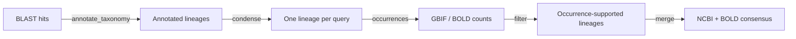

# metatax

Consensus taxonomic assignment from BLAST hits, refined with GBIF/BOLD
occurrence records for DNA metabarcoding.

`metatax` turns raw BLAST hits into a single, defensible taxonomic lineage per
query sequence (OTU/ASV), then refines those lineages against regional
occurrence records from [GBIF](https://www.gbif.org/) and
[BOLD](https://www.boldsystems.org/). It targets diet metabarcoding studies and
applies to any BLAST-based taxonomic assignment.

## Pipeline



| Step | Command | What it does |
|------|---------|--------------|
| 1. Annotate | `Rscript scripts/annotate_taxonomy.R` | Adds a full lineage to each BLAST hit using NCBI taxonomy. |
| 2. Condense | `metatax condense` | Collapses many hits per query into one lineage by rank-wise consensus. |
| 3. Occurrences | `metatax occurrences` | Annotates lineages with GBIF/BOLD record counts for a region. |
| 4. Filter | `metatax filter` | Trims each lineage to the finest rank with occurrence support. |
| 5. Merge | `metatax merge` | Combines NCBI- and BOLD-derived tables into one consensus lineage. |

## Install

```bash
pip install -e .            # runtime use
pip install -e ".[dev]"     # plus pytest, black, ruff
```

The annotation step additionally needs R with the
[`taxonomizr`](https://cran.r-project.org/package=taxonomizr) package:

```r
install.packages("taxonomizr")
```

## Usage

### 1. Annotate BLAST hits with taxonomy (R)

```bash
Rscript scripts/annotate_taxonomy.R data/blast/sample.blast data/taxonomy/sample_annotated.txt
```

The input is a tab-delimited BLAST table containing an `staxids` column. On
first run the script builds a local NCBI taxonomy database (`accessionTaxa.sql`,
several GB); pass an existing one as a third argument to reuse it.

### 2. Condense hits into one lineage per query

```bash
metatax condense data/taxonomy/sample_annotated.txt data/taxonomy/sample_condensed.txt
```

For each query the best hit's percent identity selects how finely to resolve
(≥99 % → species, ≥97 % → genus, ≥90 % → family, ≥85 % → order, otherwise
class). The hits above the identity floor then vote: a rank is assigned when one
value covers at least 80 % of the hits that have a value there, walking up the
hierarchy until a rank agrees. Use `--qcovs-min` to change the query-coverage
cutoff (default 91).

### 3–5. Occurrence refinement

```bash
metatax occurrences data/taxonomy/sample_condensed.txt data/taxonomy/sample_ip.txt
metatax filter      data/taxonomy/sample_ip.txt        data/taxonomy/sample_ncbi.csv --source ncbi
metatax merge       data/taxonomy/sample_ncbi.csv      data/taxonomy/sample_bold.csv data/taxonomy/consensus.csv
```

`occurrences` queries GBIF and BOLD for Portugal and Spain (the Iberian
Peninsula) by default and needs network access. `filter` keeps only lineages
backed by occurrence records, trimmed to the finest supported rank. `merge`
reconciles independently derived NCBI and BOLD tables: ranks they agree on are
kept, conflicts are cleared, and a gap at any rank clears the ranks below it.

## Repository layout

```
src/metatax/        # Python package (condense, occurrences, filter, merge, CLI)
scripts/            # standalone runners: annotate_taxonomy.R, run_condense.sh
tests/              # pytest suite and synthetic fixtures
data/               # your local data (git-ignored)
```

## Development

```bash
pytest        # run the test suite
black src tests
ruff check src tests
```

## License

Released under the [GNU General Public License v3.0](LICENSE).
